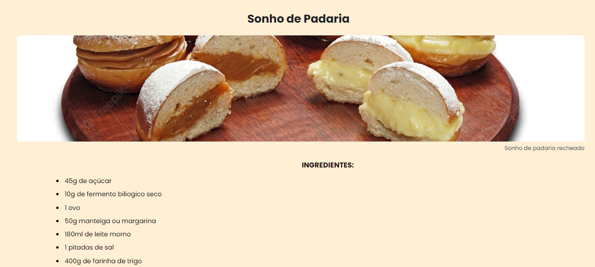

<h1 align="center">RECEITA</h1>

    Com o intuito de aprender e por em pratica os estudos, resolvir criar essa tela de "Receita" ultizando as tecnolgias citadas.

  <a href="#=tecnologias">Tecnologias</a> &nbsp;&nbsp;&nbsp;|&nbsp;&nbsp;&nbsp;
  <a href="#-projeto">Projeto</a> &nbsp;&nbsp;&nbsp;|&nbsp;&nbsp;&nbsp;

 

    

## 🚀 Tecnologias

Esse projeto foi desenvolvido com as seguintes tecnologias:

- HTML
- CSS
- Git e GitHub

## 💻 Projeto

Essa e uma "Receita" de um sonho de padaria, onde ensina ao usuario de como fazer um delicioso sonho de padaria, e degustar com seus amigos e familiares.

